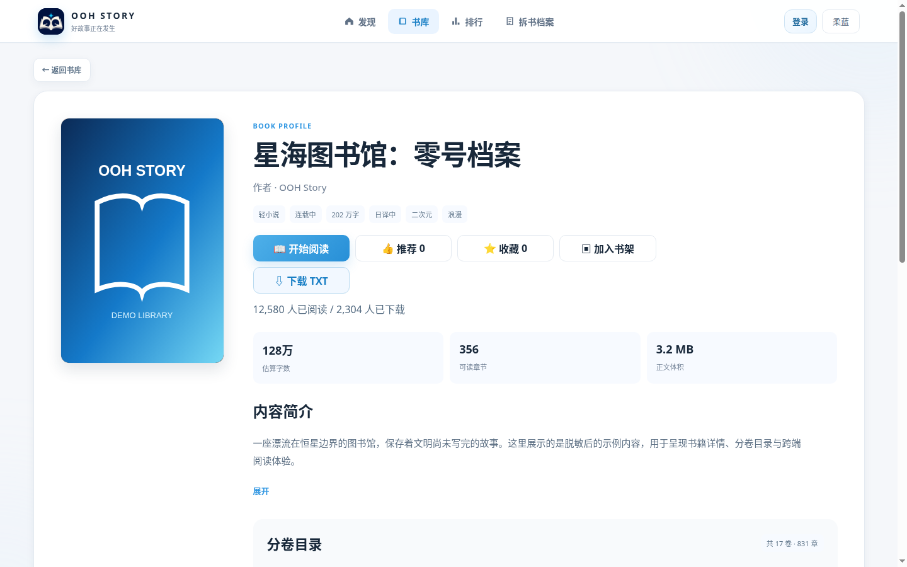
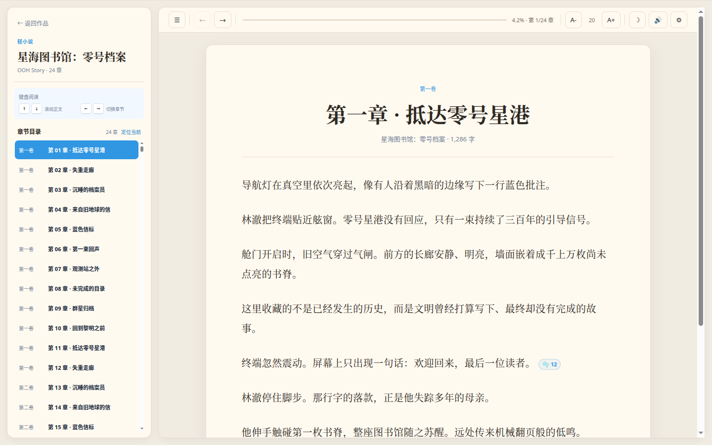
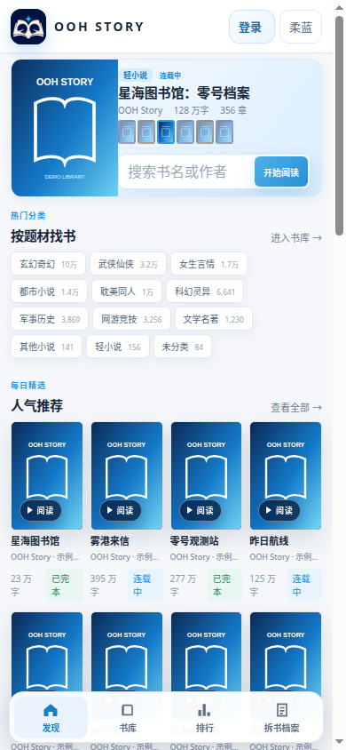

<p align="center">
  
</p>

<h1 align="center">OOH Story</h1>

<p align="center">
  可自托管的中文电子书阅读、管理与移动端平台
</p>

<p align="center">
  
  
  
  
</p>

OOH Story 是一套数据自持有、可从空环境部署的中文电子书平台。仓库包含 Web Reader、独立运维后台、书库 Backend/Worker、MySQL 数据库迁移，以及 Flutter Android/iOS 客户端源码。

> 仓库只提供程序代码与品牌静态资源，不包含小说正文、用户数据、数据库备份、签名安装包、私钥或生产凭据。部署者必须确保内容具备合法的使用和发布权。

## 界面预览

<p align="center">
  
  
</p>
<p align="center">
  
  
</p>

> 展示图使用 OOH Story 自有示例封面、书名与正文，不包含正式书库作品、用户资料或后台数据。

## 主要能力

- **跨端阅读**：响应式 Web、PWA 与 Flutter 客户端，共用书库、账户和阅读进度接口。
- **阅读体验**：章节目录、轻小说分卷与插图、听书、继续阅读、收藏、书架和阅读记录。
- **社区互动**：段落评论、用户身份与阅读等级、评论点赞、通知和投稿中心。
- **书库管理**：书籍上下架、主封面与分卷封面、目录索引、同步任务、审计与恢复记录。
- **内容安全**：投稿格式检查、恶意文件检查、评论内容过滤和公开接口权限隔离。
- **完整自托管**：正式部署采用 Linux、systemd、Nginx、MySQL 与 Redis；正文和用户数据始终由部署者自行持有。

## 仓库结构

- `app/`、`static/`：Reader、账户、阅读记录、评论、投稿与 Web UI。
- `admin/`：OOHStory Admin、书库引擎、任务脚本、001–022 MySQL 迁移和 systemd 模板。
- `mobile/`：Flutter Android/iOS 客户端源码。
- `scripts/`：本地空书库、数据库验收、可选 Compose 沙盒和敏感信息门禁。
- `deploy/`、`admin/deploy/`：原生 Linux 的 systemd、Nginx、MySQL 与 Redis 部署模板。
- `compose.yaml`：仅用于本地体验和 CI 验收的可选沙盒。

## 运行架构

```text
Browser / PWA ─┐
               ├─> Reader API ──> MySQL 书目与公共统计
Flutter App ───┘       │
                       ├────────> SQLite 账户与阅读数据
                       └────────> 部署者提供的书库目录

Admin ────────────────> Reader API / MySQL / Redis
Backend & Workers ────> MySQL / Redis / 书库目录
```

项目的正式运行架构不依赖 Docker：Reader 与 Admin 由 systemd 管理，Nginx 负责公开 Reader 的 TLS 入口，Admin 始终保持回环或受控内网访问，MySQL/Redis 作为宿主机服务运行。完整步骤见[原生 Linux 部署指南](docs/HOST_DEPLOYMENT.md)。

## 本地快速预览 Reader

只体验 Web Reader 时不需要 Docker、MySQL 或 Redis：

```bash
python3 -m venv .venv
.venv/bin/python -m pip install -r requirements.txt -r requirements-dev.txt
./scripts/init_local_library.py
cp .env.example .env
set -a
. ./.env
set +a
.venv/bin/uvicorn app.main:app --host 127.0.0.1 --port 8091
```

这条路径使用本地 SQLite 空书库。后续可导入自己有权使用的正文、目录和封面；程序不会下载或附带任何作品。

## 正式部署（不使用 Docker）

正式部署沿用项目原有方式：Python venv + systemd + Nginx + MySQL 8.4 + Redis 7。仓库已经提供：

- Reader 与 Admin 的 systemd 单元；
- Nginx/TLS、安全请求白名单与限流模板；
- MySQL 001–022 空库初始化、随机运行账号和迁移工具；
- Redis、Worker 与周期任务模板；
- 空书库初始化和最小权限配置示例。

从新 Linux 主机安装时，请按[原生 Linux 部署指南](docs/HOST_DEPLOYMENT.md)执行。模板默认使用 `/opt/oohstory-reader`、`/opt/oohstory-admin`、`/srv/oohstory/library`、`127.0.0.1:8091` 与 `127.0.0.1:8092`，可在私有部署配置中调整。

## 可选：Compose 本地沙盒

`compose.yaml` 是为开源仓库新增的便携体验和 CI 验收工具，不是 OOH Story 原有生产架构，也不是正式部署的必需条件。

需要 Docker Engine 24+、Docker Compose 2.23.1+、Python 3.12+ 和 `curl`：

```bash
./scripts/compose_up.sh
```

首次运行会：

1. 在被 Git 忽略、权限为 0600 的 `.env.compose` 生成四个独立数据库密码；
2. 同一文件只保存管理员密码哈希，随机管理员明文密码只显示一次；
3. 创建不含任何书籍的 `data/library/` SQLite/目录骨架与默认封面；
4. 启动 MySQL 8.4 并真实执行 001–022 全部迁移；
5. 创建 writer、admin-reader、public-reader 三个最小权限账号；
6. 启动 Reader 与 Admin，核验 22 个 revision、27 张表、7 个触发器和两个健康接口。

入口：

- Reader：`http://127.0.0.1:8091`
- Admin：`http://127.0.0.1:8092/admin/`
- MySQL：`127.0.0.1:13306`（仅回环，可在 `.env.compose` 修改）

停止服务：

```bash
docker compose --env-file .env.compose down
```

删除本地容器数据库属于破坏性操作，只有确认不需要数据时才执行：

```bash
docker compose --env-file .env.compose down --volumes
```

Compose 沙盒默认只把 Reader、Admin 和 MySQL 发布到 `127.0.0.1`，Redis 仅存在于内部网络。Admin 中依赖宿主机 systemd/root helper 的任务控制会安全失败关闭；完整运维能力以原生 Linux 部署为准。

## 数据库初始化保证

- `admin/deploy/mysql/001_*.sql` 至 `022_*.sql` 是 MySQL schema 唯一真源。
- `admin/deploy/mysql/init.sql` 由生成器构建，专用于空 schema，检测到现有表会拒绝覆盖。
- `admin/deploy/mysql/runtime-users.sql` 用于宿主机安装，创建三个仅限 `127.0.0.1` 的随机密码账号。
- 可选 Compose 沙盒使用相同 `init.sql`，只把账号 host 调整为隔离容器网络。
- `scripts/verify_mysql_schema.py` 同时核验 migration 文件 SHA-256、台账、表和触发器数量。
- SQLite 账户库由 Reader 自动初始化；本地书库骨架由 `scripts/init_local_library.py` 幂等创建。

数据库细节见 [`admin/deploy/mysql/README.md`](admin/deploy/mysql/README.md)。

## 移动端

```bash
cd mobile
flutter pub get
flutter analyze
flutter test
flutter run --dart-define=OOHSTORY_API_BASE_URL=http://10.0.2.2:8091
```

Android 发布签名和 Google OAuth 配置必须由部署者在 Git 外提供。详见 [`mobile/README.md`](mobile/README.md)。

## 测试与开源门禁

```bash
python3 -m venv .venv
.venv/bin/python -m pip install -r requirements.txt -r requirements-dev.txt
.venv/bin/python -m pytest -q

python3 -m venv admin/.venv
admin/.venv/bin/python -m pip install './admin[test]'
(cd admin && PYTHONPATH=src .venv/bin/python -m pytest -q tests)

node --check static/app.js
python scripts/check_repository_secrets.py .
```

GitHub Actions 另外会在真实 MySQL 8.4 服务中执行空库初始化、拒绝二次 `init.sql`、验证迁移器安全跳过已应用 revision，并对 Flutter 执行 analyze、单元测试和 Android Debug APK 构建。

## 配置与安全

- `.env.example` 是 Reader 示例；`admin/deploy/admin.env.example` 是 Admin 示例。
- 密码、SMTP/OAuth 凭据必须放在权限受控文件或被 Git 忽略的本地环境中。
- 公网生产部署应由 Nginx/TLS 终止，Admin 保持回环访问，不得直接暴露。
- 不要提交 `.env*`（示例除外）、`.runtime/`、`data/`、数据库、日志、APK/AAB、证书、密钥、压缩包或站点验证文件。

## 开源与内容边界

程序代码使用 [MIT License](LICENSE)。MIT 许可不会自动授予任何小说、翻译、封面、用户投稿、品牌或第三方服务内容的权利。

贡献流程见 [`CONTRIBUTING.md`](CONTRIBUTING.md)，漏洞报告见 [`SECURITY.md`](SECURITY.md)，发布前核对 [`OPEN_SOURCE_CHECKLIST.md`](OPEN_SOURCE_CHECKLIST.md)。
